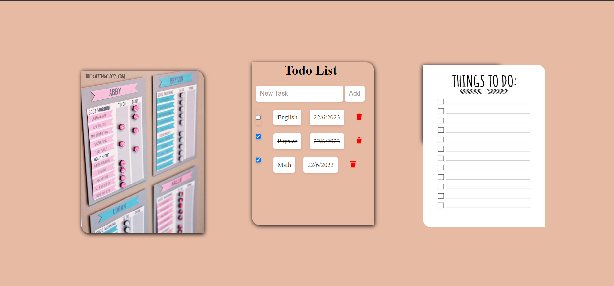

# Todo_App


## To Do App

> To Do App - это приложение, которое позволяет пользователям создавать списки дел и отслеживать задачи, которые им нужно выполнить. Пользователь может добавлять новые задачи, отмечать их как выполненные и удалять ненужные задачи. Приложение предоставляет удобный пользовательский интерфейс и корректно отображает данные.


**Пример программы так работает.**

## Особенности
- Создание списков дел с уникальными именами.
- Добавление задач в список дел.
- Отметка задач как выполненных.
- Удаление задач из списка.
- Отображение даты и времени создания задач.

## Установка

**Для установки программы, выполните следующие шаги:**

1. Установите Python на вашу систему, если он еще не установлен. Вы можете скачать Python с официального сайта: https://www.python.org/downloads/

2. Клонируйте репозиторий с программой на вашу локальную машину:
 ```bash
$  git clone https://github.com/Humoyun004/Todo_App.git
```

3. Перейдите в директорию с программой:
cd Todo_App 

## Использование

**После того, как вы загрузили django, перейдите в каталог клонированного репо и выполните следующую команду**
```bash
$ python manage.py makemigrations
```

**Это создаст все файлы миграции (миграции базы данных), необходимые для запуска этого приложения.**

**Теперь, чтобы применить эту миграцию, выполните следующую команду**
```bash
$ python manage.py migrate
```
**Один последний шаг, и тогда наше приложение todo будет запущено. Нам нужно создать пользователя-администратора для запуска этого приложения. В терминале введите следующую команду и укажите имя пользователя, пароль и адрес электронной почты для пользователя-администратора.**
```bash
$ python manage.py createsuperuser
```
 **Запустите программу с помощью команды:**
```bash
$ python manage.py runserver
```


## Дополнительные ресурсы
- **Документация Django:** https://docs.djangoproject.com/


